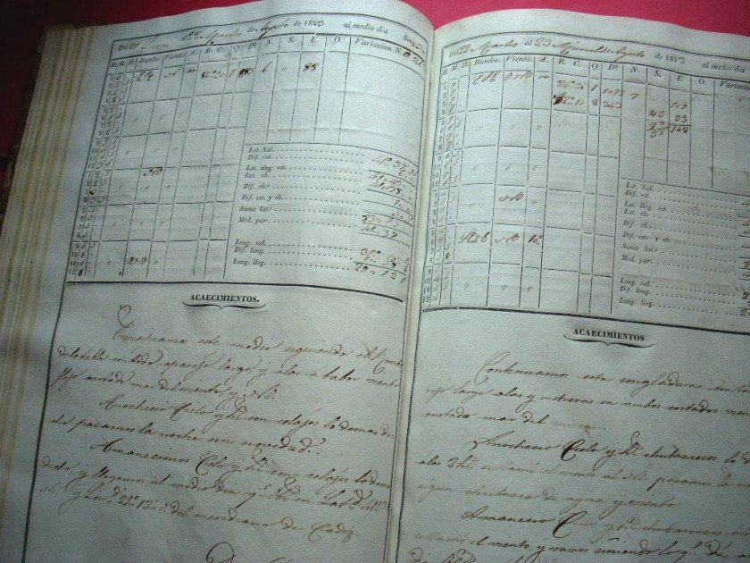
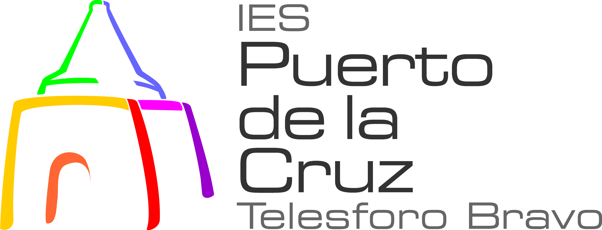

# Proyecto de Enero para la asignatura de Programación realizado por Yared, Nathan y Guillermo

Repositorio para la tarea de clase en grupo de la asignatura de Programacion de Enero de 2022

Proyectos realizados: Juego del Ahorcado y Bitacora

### Anotaciones:

## Juego del Ahorcado

Se ha creado una clase vista donde se ha realizado, con una matriz, el dibujo del Ahorcado dependiendo de cuántos fallos se lleve en el juego.

A su vez, el juego cuenta con la posibilidad de jugar solo, con 3 niveles de dificultad, o con 2 jugadores.

Existe la opción de mostrar un historial de todas las partidas y a su vez, otra opcion para mostrar un ranking donde se verán las partidas ordenadas de mejor a peor según la cantidad de puntos que se haya usado:

La clase principal desde donde se ejecuta el juego y donde se encuentra el main es en la clase **Menu**.

Se **recomienda** no probar el juego desde el Netbeans, en su lugar es preferible usar el clean & build y ejecutar el juego desde una terminal, ya que se han usado instrucciones para limpiar la terminal durante el juego para facilitar la visualización, y estas no funcionan en Netbeans

## Bitácora

Se ha creado un menú con la posibilidad de crear varios proyectos y anotaciones. A su vez, al crear una anotación se deberá indicar a cuál proyecto se le quiere añadir la anotación.

Los proyecto dentro de la Bitácora, y a su vez, las anotaciones de cada proyecto, estan ordenados por fecha de creación.

Existe la opción de eliminar proyectos enteros o anotaciones de algun proyecto, así como mostrar la Bitácora en su totalidad, algún proyecto concreto con sus anotaciones o una anotación en específico.

